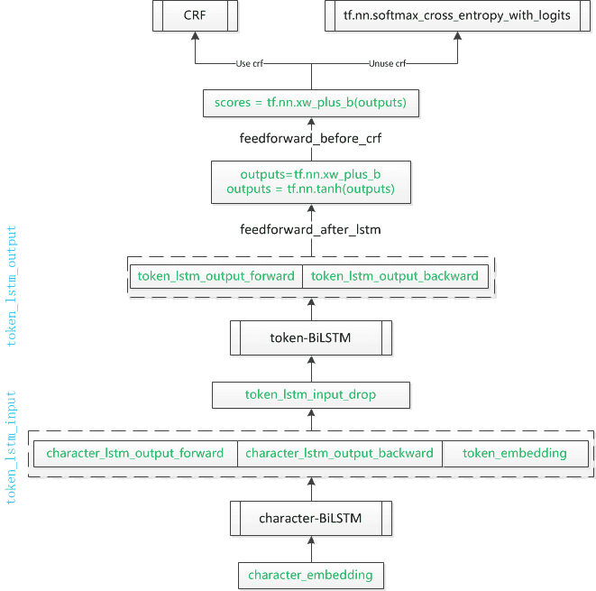

# Named Entity Recognition with Tensorflow

This repo implements a NER model using Tensorflow (LSTM + CRF + chars embeddings).

State-of-the-art performance (F1 score between 90 and 91).

Check the [blog post](https://guillaumegenthial.github.io/sequence-tagging-with-tensorflow.html)

## Task

Given a sentence, give a tag to each word. A classical application is Named Entity Recognition (NER). Here is an example

```
John   lives in New   York
B-PER  O     O  B-LOC I-LOC
```


## Model


Similar to [Lample et al.](https://arxiv.org/abs/1603.01360) and [Ma and Hovy](https://arxiv.org/pdf/1603.01354.pdf).

- concatenate final states of a bi-lstm on character embeddings to get a character-based representation of each word
- concatenate this representation to a standard word vector representation (GloVe here)
- run a bi-lstm on each sentence to extract contextual representation of each word
- decode with a linear chain CRF


## Getting started


1. Download the GloVe vectors with

```
make glove
```

Alternatively, you can download them manually [here](https://nlp.stanford.edu/projects/glove/) and update the `glove_filename` entry in `config.py`. You can also choose not to load pretrained word vectors by changing the entry `use_pretrained` to `False` in `model/config.py`.

2. Build the training data, train and evaluate the model with
```
make run
```


## Details


Here is the breakdown of the commands executed in `make run`:

1. [DO NOT MISS THIS STEP] Build vocab from the data and extract trimmed glove vectors according to the config in `model/config.py`.

```
python build_data.py
```

2. Train the model with

```
python train.py
```


3. Evaluate and interact with the model with
```
python evaluate.py
```


Data iterators and utils are in `model/data_utils.py` and the model with training/test procedures is in `model/ner_model.py`

Training time on NVidia Tesla K80 is 110 seconds per epoch on CoNLL train set using characters embeddings and CRF.


## Training Data


The training data must be in the following format (identical to the CoNLL2003 dataset).

A default test file is provided to help you getting started.


```
John B-PER
lives O
in O
New B-LOC
York I-LOC
. O

This O
is O
another O
sentence
```


Once you have produced your data files, change the parameters in `config.py` like

```
# dataset
dev_filename = "data/coNLL/eng/eng.testa.iob"
test_filename = "data/coNLL/eng/eng.testb.iob"
train_filename = "data/coNLL/eng/eng.train.iob"
```


## License

This project is licensed under the terms of the apache 2.0 license (as Tensorflow and derivatives). If used for research, citation would be appreciated.

## requiment
This project must be run in python3.
